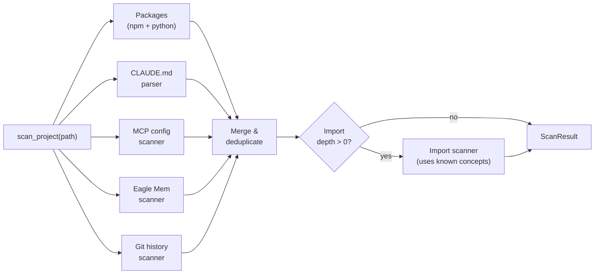
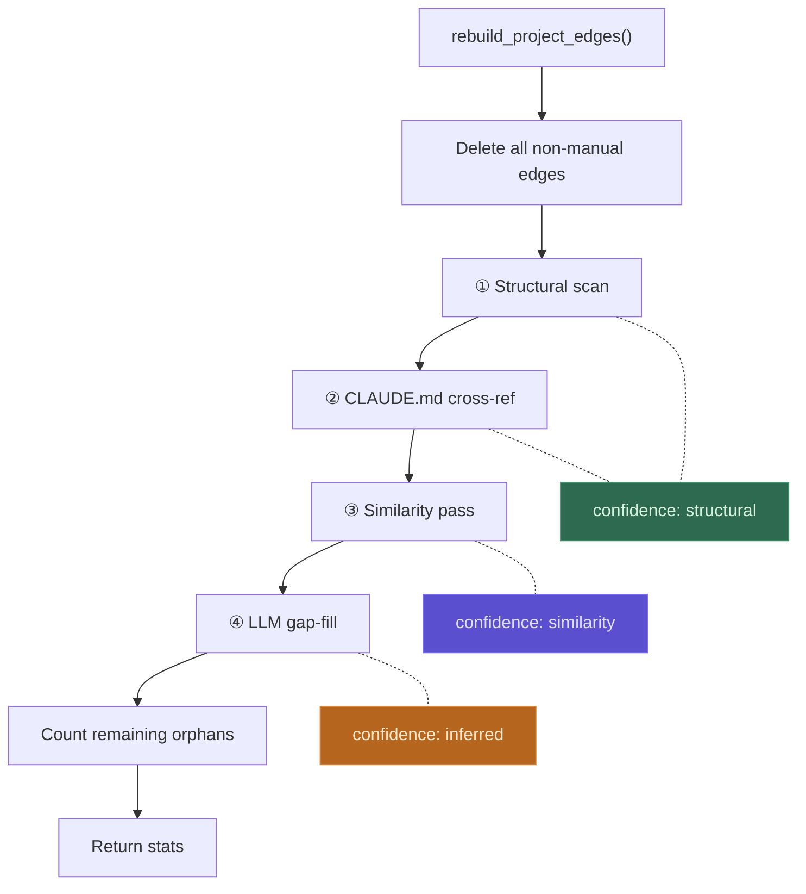
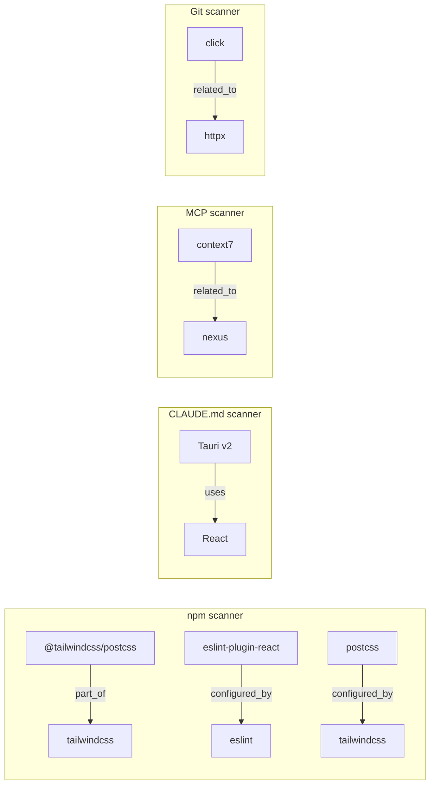
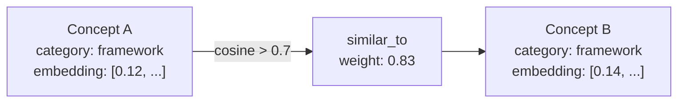
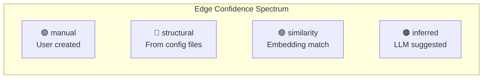
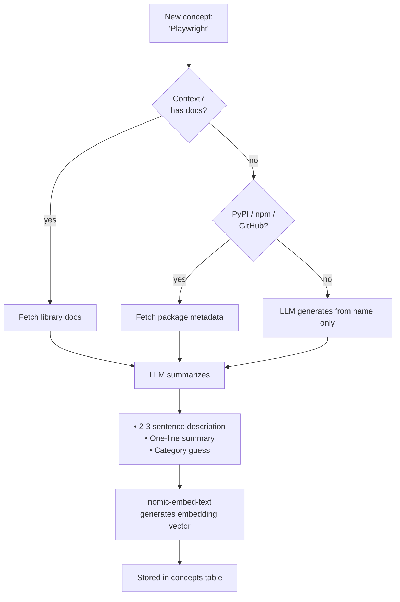

# How Nexus Builds Your Knowledge Graph

Nexus builds a knowledge graph in two phases: **discover nodes** (concepts), then **create edges** (relationships). Everything is derived from files already in your project — no manual wiring needed.

---

## Overview

```mermaid
flowchart TB
    subgraph discover["Phase 1 — Discover Nodes"]
        direction TB
        pkg["📦 Package files<br/>package.json · pyproject.toml · requirements.txt"]
        claude["📄 CLAUDE.md / AGENTS.md<br/>Stack section tools"]
        mcp["🔌 MCP configs<br/>.mcp.json · plugins.json"]
        eagle["🦅 Eagle Mem<br/>session history · CLI tools"]
        git["🔀 Git history<br/>install commands in commits"]
        imp["📥 Import scanner<br/>Python AST · TypeScript regex"]
    end

    subgraph edges["Phase 2 — Create Edges"]
        direction TB
        structural["① Structural edges<br/>from config files"]
        crossref["② CLAUDE.md cross-ref<br/>architecture → packages"]
        similarity["③ Similarity pass<br/>same category · cosine > 0.7"]
        gapfill["④ LLM gap-fill<br/>orphan concepts → skeleton"]
    end

    discover --> edges
    edges --> graph["Interactive Knowledge Graph"]

    style discover fill:#1a1a2e,stroke:#4a4a6a,color:#e0e0e0
    style edges fill:#16213e,stroke:#4a4a6a,color:#e0e0e0
    style graph fill:#0f3460,stroke:#4a4a6a,color:#e0e0e0
```

---

## Phase 1: Node Discovery

When you run `nexus scan <path>` or trigger a scan from the desktop app, six scanners run in sequence. Each extracts concepts (nodes) from different project files.



### What each scanner reads

| Scanner | Source files | What it extracts | Example |
|---------|-------------|-----------------|---------|
| **npm** | `package.json` (root + subdirs) | dependencies, devDependencies | `react`, `vite`, `eslint` |
| **Python** | `pyproject.toml`, `requirements.txt` | project dependencies | `fastapi`, `click`, `httpx` |
| **CLAUDE.md** | `CLAUDE.md`, `AGENTS.md` | `**Tool** — description` patterns in Stack section | `Tauri v2`, `Cytoscape.js` |
| **MCP** | `.mcp.json`, `~/.claude/plugins.json` | configured MCP server names | `context7`, `nexus` |
| **Eagle Mem** | `~/.eagle-mem/memory.db`, `~/.claude/skills/` | tools from session history, CLI tools, installed skills | `eagle-mem`, `gh`, `docker` |
| **Git history** | `git log --oneline -50` | install commands in commit messages | `uv add click` → `click` |

### Import scanner depth

The import scanner is opt-in and has three levels:

| Depth | Behavior | Files scanned |
|-------|----------|--------------|
| **0** (default) | Off — config files only | None |
| **1** | Entry points only | `main.py`, `app.py`, `server.py`, `src/index.ts` |
| **2** | Full source tree | All `.py`, `.ts`, `.tsx`, `.js`, `.jsx` (max 500 files) |

At depth 1+, the scanner looks for known concept names in import statements and creates `uses` edges between co-imported packages.

---

## Phase 2: Edge Creation

After nodes are synced to the database, `rebuild_project_edges()` runs four passes to create relationships. Each pass adds edges with a different **confidence level**.



### Pass ①: Structural edges

Created directly by scanners reading config files. These are the highest-confidence edges because they come from actual dependency declarations.



**Relationship types detected:**

| Pattern | Relationship | Example |
|---------|-------------|---------|
| `@scope/plugin` shares scope with `parent` | `part_of` | `@tailwindcss/postcss` → `tailwindcss` |
| `eslint-plugin-*` is a plugin for `eslint` | `configured_by` | `eslint-plugin-react` → `eslint` |
| Config pair (postcss ↔ tailwindcss) | `configured_by` | `postcss` → `tailwindcss` |
| CLAUDE.md says "built on X" | `depends_on` | from description keywords |
| CLAUDE.md says "uses X" or "via X" | `uses` | from description keywords |
| Co-configured MCP servers | `related_to` | `context7` → `nexus` |
| Installed in nearby git commits | `related_to` | `click` → `httpx` |
| Co-imported in same source file | `uses` | (import scanner, depth 1+) |

### Pass ②: CLAUDE.md cross-reference

After structural scanning, the pipeline cross-references CLAUDE.md-sourced concepts against all known package concepts. If a CLAUDE.md concept's description mentions a package name (or the package name appears in the CLAUDE.md text), a structural edge is created.

```
CLAUDE.md says: **Cytoscape.js** — interactive knowledge graph rendering
"cytoscape.js" matches package "cytoscape" in package.json
→ edge: Cytoscape.js --[uses]--> cytoscape (structural)
```

### Pass ③: Similarity pass

Compares embedding vectors between concepts. Restricted to prevent noise:

- Only pairs **within the same category** (framework↔framework, devtool↔devtool)
- Cosine similarity must exceed **0.7** (high bar)
- Always creates `similar_to` edges — never guesses the relationship type
- Confidence: `similarity`



### Pass ④: LLM gap-fill

Targets **orphan concepts** — project-layer nodes with zero edges after the first three passes. The LLM gets full project context and picks from the existing connected skeleton.

```mermaid
flowchart TD
    orphan["Orphan: MCP<br/>(no edges yet)"]
    context["Project context:<br/>• Connected skeleton: React, FastAPI, Click, ...<br/>• Eagle Mem overview<br/>• CLAUDE.md (first 2000 chars)"]
    llm["LLM (Ollama)"]
    result["JSON response:<br/>[{target: 'Claude Code', rel: 'uses', reason: '...'}]"]

    orphan --> llm
    context --> llm
    llm --> result
    result -->|"max 3 edges"| graph["Graph<br/>confidence: inferred"]
```

**Constraints:**
- LLM can only connect to concepts already in the connected skeleton
- Can return `[]` if no confident connection exists
- Maximum 3 connections per orphan
- Relationship type must be from the valid set
- If Ollama is not running, this pass is silently skipped

---

## Edge Confidence Levels

Every edge carries a confidence level that indicates how it was created:



| Confidence | Source | Survives rebuild | Example |
|-----------|--------|-----------------|---------|
| `manual` | User-created via UI or CLI | Yes | User connected "React" → "Next.js" |
| `structural` | Scanner read a config file | Recreated each rebuild | `package.json` declares dependency |
| `similarity` | Embedding cosine > 0.7 | Recreated each rebuild | "Playwright" ↔ "Cypress" |
| `inferred` | LLM suggested connection | Recreated each rebuild | LLM connected orphan "MCP" → "Claude Code" |

On each rebuild, all non-manual edges are deleted and recreated. Manual edges are always preserved.

---

## Concept Layers

Concepts are tagged with a **layer** to separate project dependencies from development environment tools:

| Layer | What it contains | Shown by default |
|-------|-----------------|-----------------|
| `project` | Actual project dependencies — the things your code uses | Yes |
| `environment` | Dev tools, linters, build tools, editor plugins | Hidden (toggle in sidebar) |

The desktop app's **"project deps only / all dependencies"** toggle in the sidebar filters the graph by layer.

---

## Enrichment Pipeline

Separate from edge creation, each concept can be **enriched** with AI-generated descriptions and embeddings. This runs when you add a concept or trigger bulk enrichment.



Enrichment is optional — the graph works without AI. If Ollama is not running, concepts are stored with just their name and source.

---

## Trigger Points

The graph pipeline runs at several points:

| Trigger | What happens |
|---------|-------------|
| `nexus scan <path>` | Full scan + edge rebuild |
| `nexus scan <path> --enrich` | Full scan + edge rebuild + AI enrichment |
| Desktop: project scan button | Full scan + edge rebuild (background) |
| Desktop: "infer relationships" | Edge rebuild only (no rescan) |
| `nexus mcp install` hooks | PostToolUse hook tracks installs passively |
| Session end hook | Auto-scans project if hooks are installed |

---

## Example: Scanning a React + FastAPI Project

```
$ nexus scan ~/projects/my-app --enrich

Scanning ~/projects/my-app...
  packages (npm): 12 concepts, 4 relationships
  packages (python): 8 concepts, 0 relationships
  CLAUDE.md: 3 concepts, 2 relationships
  MCP configs: 2 concepts, 1 relationships
  Eagle Mem: 1 concepts, 0 relationships
  git history: 0 concepts, 2 relationships

Syncing to database...
  + react (package_scan)
  + fastapi (package_scan)
  + tailwindcss (package_scan)
  ...
  ~ eslint-plugin-react --[configured_by]--> eslint
  ~ @tailwindcss/postcss --[part_of]--> tailwindcss

Rebuilding edges...
  structural: 9
  similarity: 5
  inferred: 3
  orphans: 1

Enriching 26 concepts...
  ✓ react — fetched Context7 docs
  ✓ fastapi — fetched Context7 docs
  ✓ tailwindcss — fetched Context7 docs
  ...
```

The result: 26 nodes and 17 edges, built entirely from reading your project's config files, with AI filling in the gaps.
